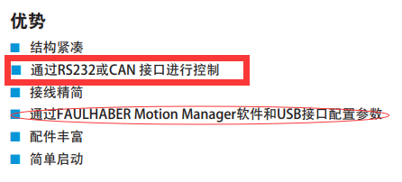
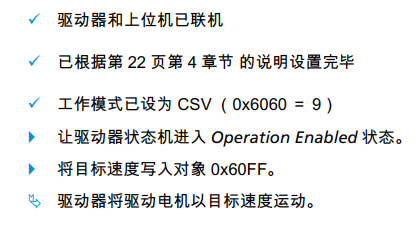
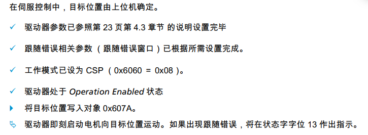

# 基于STM32速度环的上位机位置环控制

## MiniPID的用法
``` cpp
MiniPID pid=MiniPID(1,0,0);
//set any other PID configuration options here. 

while(true){
  //get some sort of sensor value
  //set some sort of target value
  double output=pid.getOutput(sensor,target);
  //do something with the output
  delay(50);
}
```

## 串口通讯数据的定义
mode：00 stop
01 start
02 target
03 sensor


# 基于FAULHABER MC5010S 的驱动设置

## 之前的问题 
阅读手册 发现USB连接只能与Motion Manager进行通讯设置，如果使用RS232的话需要用X2 COM的三根线,即USB只能用于和他自己的软件连接


/## 2022/07/04
首先如果要使用RS232作为通讯，需要一个RS232转usb，不是CH340，CH340是TTL
硬件购买完毕了
然后是通讯协议

|Byte|SOF|length|NODE|COMMAND|DATA|CRC|EOF|
|:---:|:---:|:---:|:---:|:---:|:---:|:---:|:---:|
|length|1|1|1|1|DataLenght|1|1|

后续的命令中忽略SOF和EOF为

|Byte|length|NODE|COMMAND|DATA|CRC|
|:---:|:---:|:---:|:---:|:---:|:---:|
|length|1|1|1|DataLenght|1|

现在的commucation settings 0x0038302

启动：
|Byte|length|NODE|COMMAND|DATA|CRC|
|:---:|:---:|:---:|:---:|:---:|:---:|
|length|1|1|1|DataLenght|1|
|content|length|NodeNum|0x00|Devicename|CRC|

??RS232用不了

启动流程
我这里只有一个NODE 所以NODENUM=1

如果要进行设置看的RS232通讯手册和驱动功能两个PDF


## 2022/07/05

需要设定单位换算
### *控制字*
控制器启动 控制字 0x6040 0x00 +U16
下面指的是U16
首先使能0x0006->0x0007->0x000F
退出控制 去使能->0x0007->0x0006
### *状态字*
0x6041 0x00 +U16 只读
若进入操作状态则为0x000 0010*111

### *配置驱动器*
这里不用管，因为已经通过Motion MAnager保存在机器里了
即到4.8因子群？目前的策略是都不管，按减速比60在上位机处处理

### *工作模式选择*
关键是要从这里读取需要的参数

0x6060 0x00 设置 +S8
0x6061 0x00 读取
应该在软件里设置过了，所以这里的读取一次确认就可以了
如果是CSV的话应该是9 CSP为8
CSP ：目标位置0x607A
      实际位置0x6064
      实际速度0x606C
      实际转矩0x6077

CSV： 目标速度0x60FF
      实际位置0x6064
      实际速度0x606C
      实际转矩0x6077
大致上就是这些

### *RS232*
SOF - S
EOF - E

CRC是计算2-N的 就是除了SOF和EOF的部分

用户数据长度（除去首位标识）不能超过62字节，也就是加上不能超过64字节

command 部分 controlword 0x04
             stateword   0x05
             tracelog    0x06
读取参数好像用了SDO，这个后面看，确实是用了SDO 在command=0x01和0x02时进行处理

然后关于stateword的读取，他不是请求发送的形式进行的，而是当state发生变化时自动发送的

### *CRC计算*
计算方法如图所示  

```python
def calcCRC(temp):
    CRC=0xFF
    Polynom=0xD5
    CRC=CRC^temp
    for i in range(8):
        if CRC&0x01:
            CRC=CRC(CRC>>1)^Polynom
        else:
            CRC>>=1
    return CRC

```
这是单个字节的CRC计算方法，如果计算多个字节的结果也是比较简单的，先计算第一个字节的crc结果，然后把第一个字节的crc结果与第二个字节进行异或， 异或后的值再进行一次crc计算就可以了，多个字节也是反复这过程就好

这里在写C++程序的时候还有一个需要注意的问题是，数组数据的传递，指针什么的再看一眼

### *关于几种位置的程序示例*
在驱动功能的第五章对各个运行模式的介绍中有详细的示例，这里对需要使用的CSV和CSP进行介绍
#### CSV

#### CSP



## 2022/07/06

早上基本把收发都DEBUG完了，下一步在转换器到之前可以考虑先尝试做一下pybind
